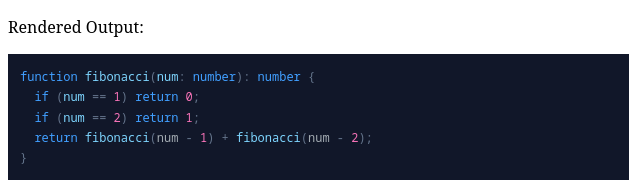
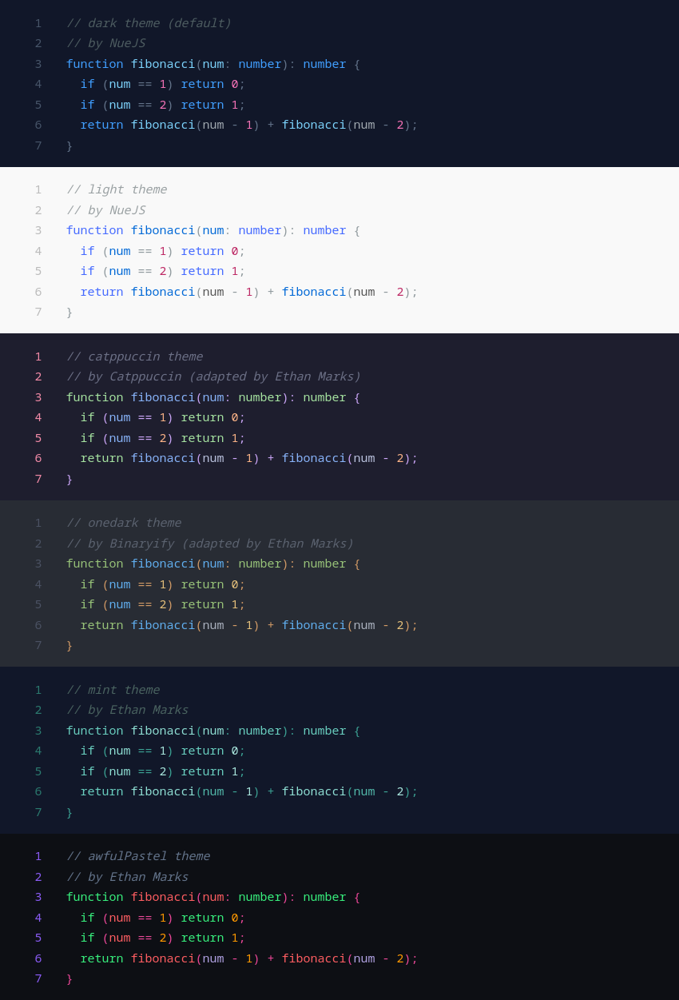

# lume_nueglow

[](https://ethmarks.github.io/lume_nueglow/)
[](https://github.com/ethmarks/lume_nueglow)
[](https://www.jsdelivr.com/package/gh/ethmarks/lume_nueglow)

This is a [Lume](https://lume.land) plugin to add support for
[Nueglow](https://nuejs.org/docs/nueglow).

## Quickstart

```ts
// _config.ts
import lume from "https://cdn.jsdelivr.net/gh/lumeland/lume/mod.ts";
import nueglow from "https://cdn.jsdelivr.net/gh/ethmarks/lume_nueglow/mod.ts";

const site = lume();

site.use(nueglow());

export default site;
```

````md
<!-- index.md -->

Rendered Output:

```ts
function fibonacci(num: number): number {
  if (num == 1) return 0;
  if (num == 2) return 1;
  return fibonacci(num - 1) + fibonacci(num - 2);
}
```
````



## Options

`lume_nueglow` is highly configurable. You can configure how the CSS is handled,
what theme (if any) to use, and how much of Nueglow's
[special syntax](https://nuejs.org/docs/syntax-highlighting) to enable.

```ts
import { type Options } from "https://cdn.jsdelivr.net/gh/ethmarks/lume_nueglow/mod.ts";

const opt: Options = {
  /**
   * The CSS output mode.
   *
   * * 'inline': Directly injects the nueglow styles into a <style> block in
   * the <head> of every page that uses nueglow.
   * * 'file': Writes the nueglow styles to a new file based on the 'cssPath'
   * plugin option. If you choose this option, remember that _you_, the plugin
   * user, are responsible for ensuring that every page that uses nueglow
   * imports this file.
   * * 'manual': Disables automatic CSS output. This lets you set your own
   * styles.
   * * false: Alias for 'manual'.
   *
   * Default is 'inline' to make the plugin plug-and-play, but I recommend
   * setting it to 'file' or 'manual' for performance and customizability.
   */
  css: "file",

  /**
   * The path to output the CSS file to if CSS output mode is 'file'.
   *
   * Default is '/glow.css'.
   */
  cssPath: "glow.css",

  /**
   * Whether to minify the CSS.
   *
   * Default is true.
   */
  minifyCSS: true,

  /**
   * The theme of the CSS.
   *
   * * 'dark': A dark theme sourced from
   * https://nuejs.org/glow-demo/dark.css.
   * * 'light': A light theme sourced from
   * https://github.com/nuejs/nue/blob/master/packages/nueglow/css/light.css.
   * * 'catppuccin': A dark theme adapted by me based on
   * https://catppuccin.com/palette/.
   * * 'onedark': A dark theme adapted by me based on
   * https://github.com/Binaryify/OneDark-Pro/.
   * * 'mint': A monochromatic dark theme made by me.
   * * 'awfulPastel': a dark theme made (poorly) by me.
   * * 'none': No theme.
   */
  theme: "dark",

  /**
   * Whether to enable line numbering.
   *
   * Default is false.
   */
  numbered: false,

  /**
   * Whether to parse diff prefixes (+/-) and callouts (>) in nueglow.
   *
   * Default is true.
   */
  prefix: true,

  /**
   * Whether to parse marking (•foo•) and highlighting (••foo••) in nueglow.
   *
   * Default is true.
   */
  mark: true,
};
```

## Themes

Unlike other code highlighters such as [Shiki](https://shiki.style/themes) which
use
[massive JSON files](https://github.com/shikijs/textmate-grammars-themes/blob/main/packages/tm-themes/themes/one-dark-pro.json),
Nueglow uses a classless design system which makes it extremely easy to style.

### Included Themes

`lume_nueglow` comes with a few themes by default, which you can select via the
`theme` option.



### Custom Themes

Theming the default syntax styles (which are injected or supplied when the `css`
option is set to `inline` or `file`) is simply a matter of adjusting a handful
of CSS custom properties.

For example, here is the Catppuccin theme in its entirety:

```css
[glow] {
  --glow-bg-color: #1e1e2e;
  --glow-font-color: #cdd6f4;
  --glow-primary-color: #89b4fa;
  --glow-secondary-color: #fab387;
  --glow-accent-color: #a6e3a1;
  --glow-special-color: #f5c2e7;
  --glow-error-color: red;
  --glow-base-color: #bac2de;
  --glow-char-color: #cba6f7;
  --glow-comment-color: #6c7086;
  --glow-counter-color: #f38ba8;
  --glow-selected-color: #585b7040;
}
```

### Custom Styles

If you choose to disable the default syntax styles (by setting the `css` option
to `manual`), you can define your own syntax styles. A guide on how to do this
is available
[here](https://nuejs.org/docs/syntax-highlighting#styling-with-css).

## Contributing

See [CONTRIBUTING.md](CONTRIBUTING.md).

## Credits

### ArnavK-09

`lume_nueglow` was inspired by
[ArnavK-09's lume_glow plugin](https://github.com/ArnavK-09/lume_glow). I
encountered it because I was trying to add Nueglow to one of my Lume sites and
was checking to see if any plugins already existed.

However, because `lume_glow`
[uses hardcoded `githubusercontent` links](https://github.com/ArnavK-09/lume_glow/blob/main/plugin.ts#L27:L31)
that have since stopped working, it injects every page with
`<style>404: Not Foundpre { overflow-x: auto }</style>` and not the actual
styles. The hardcoded links can't be configured in any way, nor can you even
disable the `<style>` injection. I considered submitting a PR, but the plugin
doesn't seem to be actively maintained.

Instead, I decided to make my own plugin, borrowing the basic structure of
ArnavK-09's plugin but expanding it significantly. I took the opportunity to
implement the features and configuration options that I wished the plugin had in
the first place.

### NueJS

`lume_nueglow` uses the [`nue-glow`](https://npmjs.com/package/nue-glow) package
developed by the NueJS team. I also used some of the styles, themes, and example
snippets from the nueglow documentation.

### Lume

`lume_nueglow` imports a few types from [Lume](https://lume.land/) and uses its
[excellent plugin system](https://lume.land/docs/advanced/plugins/).

### Catppuccin

The included `catppuccin` theme was adapted by me, but I used the
[Catppuccin palette](https://catppuccin.com/palette/) as reference.

### OneDark

The included `onedark` theme was adapted by me, but I used the
[OneDark-Pro VSCode theme](https://github.com/Binaryify/OneDark-Pro/) made by
Binaryify as reference.

## License

This project is under an MIT License. See [LICENSE](LICENSE) for more
information.
